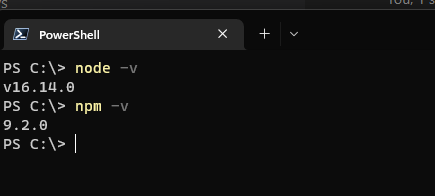
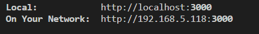
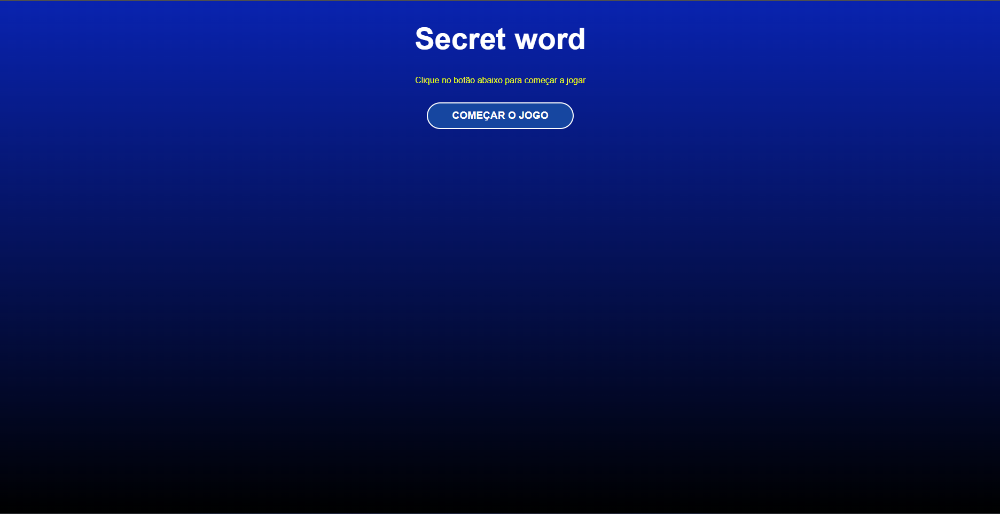
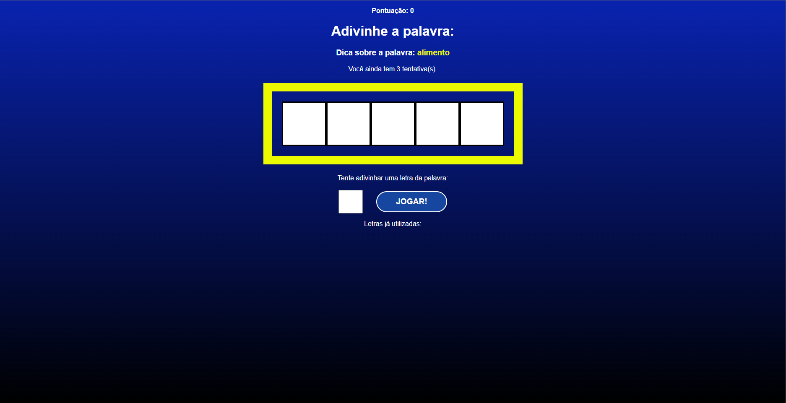
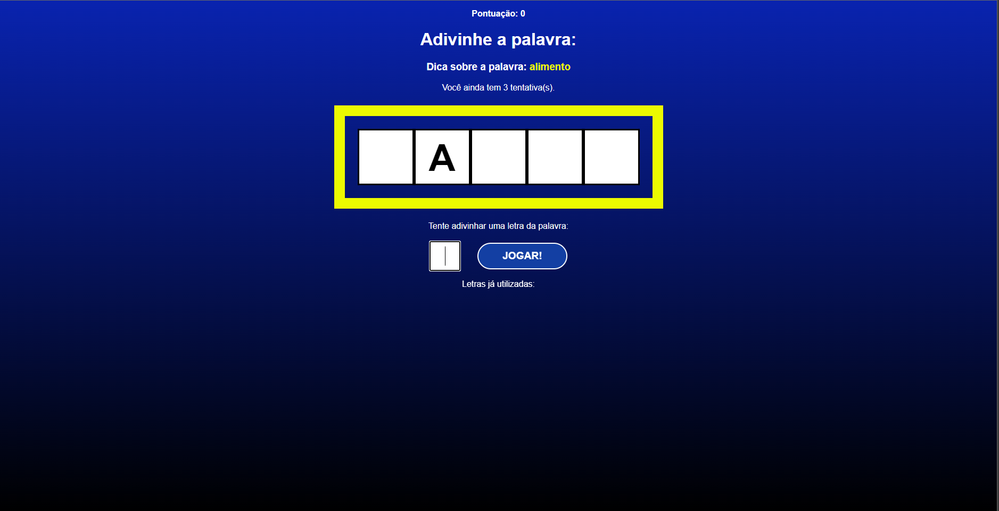
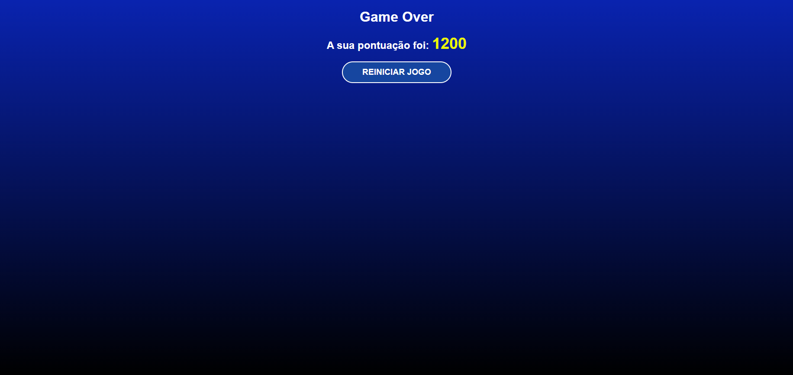

# SecretWord

Um projeto feito para estudo de um minijogo para descobrir a palavra

## ferramentas utilizadas
* React

## Rodar o projeto

1- instale o Node em seu computador

* pelo site oficial, basta [clicar aqui](https://nodejs.org/en/)

2- Verifique se foi instalado corretamente o node e o npm

* abra o powershell e digite:
  
  ```shell
   node -v
   ```

* e depois:

  ```shell
    npm -v
  ```

se tiver resultados parecido a este com a versão dos dois está instalado corretamente.



3- Clone o repositório do projeto em alguma pasta no seu computador

```shell
git clone https://github.com/Evertonmag/SecretWord.git
```

4- Entre na pasta do projeto

```shell
cd .\SecretWord\PrimeiroProjeto\secret_word\
```

5-Inicie o projeto pelo npm

```shell
npm start
```

## Como Jogar

1- Após a filalização da compilação do projeto no powersehell clique no link do linha do local



2- Após abrir o seu navegador irá estar nessa tela:



3- Clique em COMEÇAR O JOGO

4- Ao ir para a nova tela tera uma dica sobre a palavra em dourado e um retangulo gold com cada quadrado representando a quantia de letras que tem na palavra. Abaixo disso, terá um campo para voce digitar uma letra e ao clicar enter ou no botão Jogar irá ser inserido a letra caso acertou ou ira considerar como um erro tirando uma tentativa e acrescentará na listagem de letras utilizadas.





5- Ao finalizar todas as tentativas será finalizado o jogo



6- A cada 1000 pontos irá ganhar 1 tentativa a mais

<!-- 7- Ao chegar em 10000 pontos irá ganhar o jogo -->
